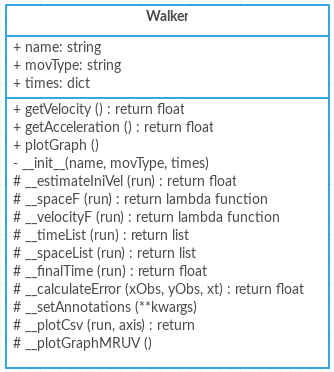
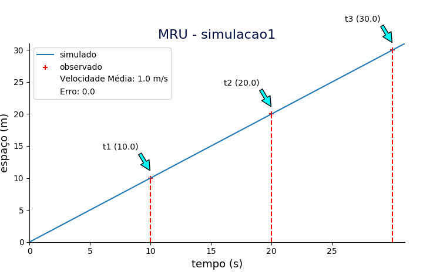
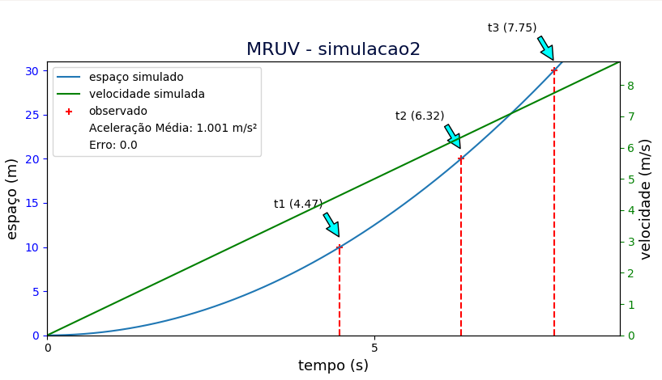
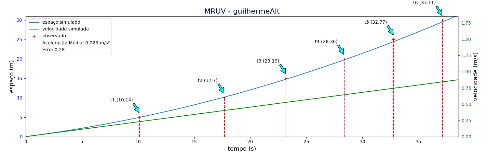
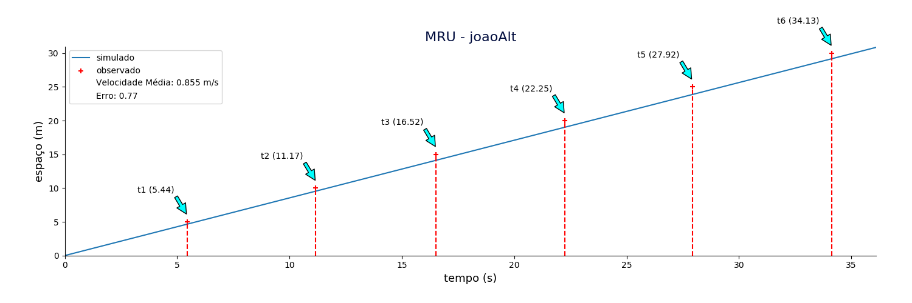
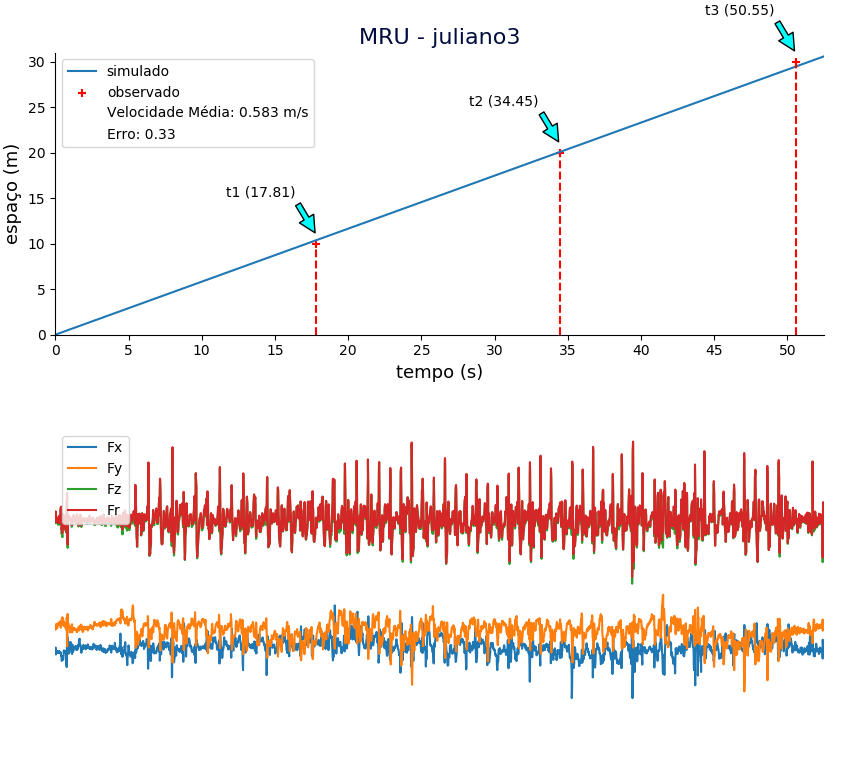
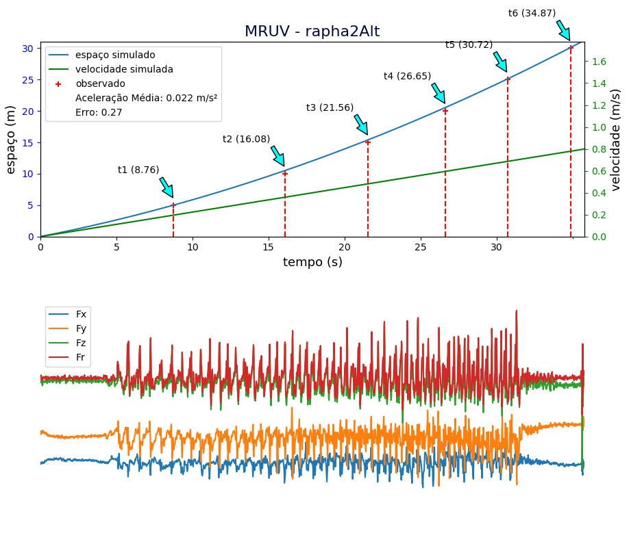
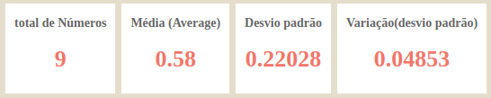
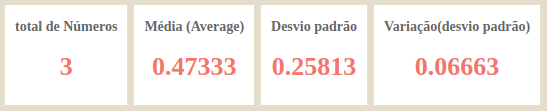
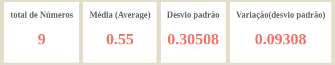

### 1. Introdução

O EP1 consiste em realizar um experimento já feito em sala, do início ao fim. Isto é, observar um fenômeno, medir com um tipo de sensor, obter dados acerca do experimento, utilizar uma modelagem matemática e finalmente analisar os dados e simular o fenômeno, que é a síntese computacional.

O experimento é um estudo do movimento retilíneo uniforme (MRU) e movimento retilínio uniformemente variado (MRUV), observando a movimentação dos integrantes do grupo em um espaço controlado, usando sensores do celular em conjunto com a medição do tempo usando cronômetros.

Com esse experimento espera-se observar as semelhanças e diferenças (erros) entre a simulação analítica do MRU e MRUV, e comparar com o que foi obtido manualmente na prática do experimento.

### 2. Experimento

Para realizar o experimento da travessia conforme proposto pela descrição, foi necessário decidir a forma na qual movimentos seriam feitos. Pensou-se em utilizar as esteiras do metrô Consolação na captura dos tempos do movimento constante, uma vez que cada uma delas tem 48 metros e mantém velocidade constante enquanto estão em movimento. Entretanto, o receio de causar alguma reação negativa nos funcionários do metrô fez com que a ideia fosse descartada. Utilizar uma bicicleta desacelerando para o movimento uniformemente variado também foi outra ideia para executar o movimento, porém não foi possível deslocar uma bicicleta para tal.

Para o movimento retilínio uniforme, optou-se por traçar linhas a cada 0,5m por todo o percurso de 30 metros a ser percorrido e assim, o indívuo que caminhava pôde manter seus passos uniformes. Mas não utlizou-se metrônomo para controlar o ritmo dos passos nesse caso, pois a contagem mental mostrou-se eficiente. Já para o movimento retilínio uniformemente variado, além das linhas utilizou-se o auxílio de uma metrônomo acelerado.

Foi necessário repetir o experimento no dia seguinte após sua realização, pois alguns arquivos .csv com os dados do acelerômetro capturados pelo aplicativo Physics Tool Box estavam com taxa de amostragem muito discrepantes entre si devido as diferenças entre os aparelhos celulares. Esse erro foi corrigido utilizando o mesmo aparelho para gravar os dados do sensor.

A visualização do experimento pode ser observada no vídeo:

[https://www.youtube.com/watch?v=ItM1CYPSlik](https://www.youtube.com/watch?v=ItM1CYPSlik)

### 3. Método

####3.1 Descrição do algoritmo

O programa EP1 tem como objetivo receber dados do experimento da travessia de forma genérica, ou seja, o programa deve calcular as estatísticas de quaisquer entrada de dados, independentemente da quantidade de travessias realizadas. Entretanto, o programa deve admitir como padrão uma travessia de 30 metros.

Como cada pessoa pode realizar dois tipos de travessias distintas (MRU E MRUV), é interessante dar a entrada de dados separando cada pessoa com seus respectivos tempos. Além disso, temos múltiplas travessias e a medição dos tempos pode ser realizada de duas formas: normal e alternada.

Após a leitura dos dados, calcula-se a velocidade média (caso a travessia atual seja do tipo MRU) ou a aceleração média (tipo MRUV) para cada indivíduo durante sua respectiva travessia. Assim sendo, o programa simula o movimento da travessia de cada indivíduo utilizando as equações analíticas do respectivo movimento.

Como está descrito na especificação do EP1, nós utilizamos os dados de tempo capturados pelo acelerômetro para fazer as simulações no programa.

Então, plota-se:

Se MRU:

- A velocidade média;
- Gráfico da função que descreve a simulação do movimento (Espaço x Tempo) e os dados obtidos pelos observadores durante o experimento real;
- Gráfico dos dados obtidos pelo acelerômetro;
- Erro entre a simulação e o experimento real.

Se MRUV:

- A aceleração média;
- Gráfico da função que descreve a simulação do movimento (Espaço x Tempo) e os dados obtidos pelos observadores;
- Gráfico da função que descreve a simulação da velocidade (Velocidade x Tempo);
- Gráfico dos dados obtidos pelo acelerômetro;
- Erro entre a simulação e o experimento real.

####3.2 Implementação do algoritmo

Python 3.6 foi usado para a criação do código pois é a versão mais atualizada da linguagem e ele possui f-strings (formatted strings literals) que facilita a formatação de strings para exibir nos gráficos do programa.
A notação JSON (JavaScript Object Notation), por ser fácil de ler e escrever para seres humanos, apresenta-se como um bom formato para a leitura dos dados. Além disso é uma formatação leve para as máquinas interpretarem e isso justifica sua escolha como formato de entrada para esse programa.

O programa recebe um arquivo *.json* com os dados do experimento realizado. O arquivo contém um vetor na qual os elementos são vetores e cada um destes possui as seguintes informações:

- *"walker"*: Contém o nome da pessoa que realizou o experimento;
- *"movType"*: Contém o tipo de movimento realizado (MRU ou MRUV);
- *"Times"*: Matriz que contém vetores com as informações de cada travessia. Esses vetores tem quatro variáveis: *"mtype"* que contém o tipo de travessia (normal ou alternada), *"csv"* que contém o nome do arquivo CSV, *"measures"* que contém os tempos observados na travessia e *"tcsv"* que contém o tempo inicial e final de acordo com as medições feitas na aplicativo Physics ToolBox.

Abaixo está um exemplo de entrada no formato *json*:

```json
{
"walker":"João",
"movType":"MRU",
"times":[{"mType":"N", "csv":"joao1", "measures":"|11.03|22.47|33.83|10.70|22.09|33.62|",
        "tcsv":[7.70, 42.50]},
         {"mType":"N", "csv":"joao2", "measures":"|10.97|22.04|33.31|10.90|22.00|33.47|",
         "tcsv":[10.10, 44.40]},
         {"mType":"N", "csv":"joao3", "measures":"|11.04|22.10|33.49|12.70|22.04|33.69|",
         "tcsv":[5.85, 40.55]},
         {"mType":"A", "csv":"joaoAlt", "measures":"|5.44|11.17|16.52|22.25|27.92|34.13|",
         "tcsv":[7.30, 42.40]}
        ]
}
```

O programa utiliza o paradigma de orientação à objetos pois é vantajoso tratar cada indivíduo que realizou o experimento como um objeto, visto que aplicam-se operações similares a todos eles. Dessa forma, a reusabilidade de código é favorecida com essa escolha.

A classe Walker modela o indivíduo que realizou o experimento. Abaixo há uma representação geral desta classe usando UML:

{#id .class width=220}

Recebe como argumento as variáveis *"walker"*, *"movType"* e *"Times"*, presentes no arquivo de entrada JSON. Seus métodos públicos são:

 - *getVelocity()*: A função usa a equação $v = \frac{\Delta s }{\Delta t}$ (neste experimento, $\Delta s = s\textsubscript{f} = 30m$ e $\Delta t$ o tempo total da travessia) para calcular a velocidade média da travessia e então tira a média de todas as travessias da pessoa e retorna este valor.

 - *getAcceleration()*: Esta função usa a equação $a = 2 \cdot \frac{s - v\textsubscript{0} \cdot t\textsubscript{f}}{t \textsubscript{f}}$ ($s$ é igual a trinta metros, $v\textsubscript{0}$ é a velocidade inicial do sistema e $t\textsubscript{f}$ o tempo total da travessia) para calcular a aceleração do sistema, porém antes de aplicarmos essa equação é necessário calcular $v\textsubscript{0}$, que será feito quando a equação $\frac{S_2 - \frac{S_2 t_1 - S_1 t_2}{t_1 t_2 (t_2 - t_1)} t_2^2}{t_2}$ for resolvida (ver código fonte para uma melhor explicação da equação). No final da função a média das acelerações sera calculada e retornada.

- *plot_graph()*: Plota um gráfico relevante para cada travessia:

    - No caso do movimento ser do tipo **MRU**, usando a equação $\Delta s = v\textsubscript{m} \cdot \Delta t$, $v\textsubscript{m}$ sendo a velocidade média da travessia e $t$ um tempo qualquer. Uma simulação do movimento é feita e seu gráfico **Espaço x Tempo** é plotado e, junto com ele, os pontos coletados no experimento, o erro (a média da diferença entre os tempos simulados e obeservados) e o gráfico dos dados obtidos pelo acelerômetro.

    - No caso do movimento ser do tipo **MRUV**, utiliza-se as equações $\Delta s = v\textsubscript{0} \cdot t + \frac{a \cdot t^2}{2}$, e $v = a \cdot \Delta t$ para simular o movimento e plotar o gráfico **Espaço x Tempo e Velocidade x Tempo**. Além disso, plota-se a aceleração média, os dados obtidos no experimento, o erro (a média da diferença entre os tempos simulados e observados) e em baixo, os dados obtidos pelo acelerômetro.

- *plotInfo()*: Plota uma pequena janela que possui  o nome da pessoa que realizou o experimento, o tipo de movimento (MRU ou MRUV) e a velocidade média/aceleração média de todas as travessias da pessoa, caso receba um *Walker* como argumento. Senão, escreve a mensagem e o título recebidos como *keyword argument*.

###4. Verificação do Programa

Devido a simplicidade dos movimentos simulados, o fato do protocolo de aquisição dos dados ser bem definido, o experimento ser bem controlado e algumas considerações feitas no algoritmo (comprimento do percurso igual a trinta metros, por exemplo), não há casos especiais que possam ser analisados.

Considerando um indivíduo com velocidade constante igual a $1 m/s$, usando a equação $s = v \cdot t$, essa pessoa leva 10 segundos para atingir a posição de 10 metros, 20 segundos para atingir a posição de 20 metros e 30 segundos para atingir a posição de 30 metros.
Agora considerando alguém que anda com aceleração constante igual a $1 m/s^2$ e possui velocidade inicial igual a 0m/s, em 4.472 segundos ela passa pela posição de 10 metros, em 6.324 segundos ela passa pela posição de 20 metros e em 7.745 segundos ela passa pela posição de 30 metros. Seguem os gráficos obtidos com essas entradas:

{#id .class width=400}

{#id .class width=400}

### 5. Dados

Segue alguns resultados obtidos usando os dados enviados no arquivo json:

{#id .class width=600}
{#id .class width=600}

{#id .class width=450 height=450}

{#id .class width=450 height=450}

$\\$
$\\$
$\\$
$\\$
$\\$
$\\$
$\\$
$\\$
$\\$
$\\$
$\\$
$\\$
$\\$
$\\$
$\\$
$\\$

### 6. Análise

Conforme será mostrado, em média o erro do programa diminui se houver um aumento na taxa de amostragem de tempo. Por esse motivo, a medição normal (medição dupla do tempo nas posições 10m, 20m e 30m) e a medição alternada (medição única porém nas posições 5m, 10m, 15m, 25m e 30m) possuem erros diferentes. Usando os dados fornecidos no arquivo .json temos:

{#id .class width=400}

{#id .class width=400}

{#id .class width=400}

{#id .class width=400}

### 7. Interpretação

Com os dados coletados é possivel verificar que o algoritmo escrito consegue simular os movimentos (MRU e MRUV) de forma precisa (erro médio baixo), com isso podemos concluir que o sistema físico analisado não possui variáveis significativas que não foram consideradas no algoritmo (como atrito, resistência do ar, etc). Em suma, o modelo matemático é uma boa simulação da realidade, no caso do nosso experimento, já que o erro foi bastante baixo e não vimos grande discrepância com o que foi previsto na modelagem matemática e o que foi observado na execução do experimento em si.

Uma sugestão em relação ao projeto seria fazer a especificação do EP em conjunto com a turma, e ler a especificação para a sala, visto que há trechos que só depois fomos perceber que podiam ser interpretados de outras formas. Outro ponto sobre a especificação do programa é a sugestão de  uma maior padronização do que é esperado do EP, qual é o objetivo central que se espera obter com o experimento, etc.

### 8. Crítica

Em termos técnicos, o grupo adquiriu melhor entendimento sobre orientação a objetos e aspectos de programação funcional em python (closures, lambdas, função map, etc), manipulação de estruturas de dados como dicionários e json, a biblioteca gráfica do matplotlib, além de aprender mais sobre a edição de vídeos e efeitos especiais.
Como um todo, o grupo aprendeu com alguns desafios e a organização de um projeto em equipe. A divisão de tarefas, comunicação interpessoal e trabalhar em conjunto no código, fazendo a análise do experimento e escrevendo o relatório, foram alguns dos aspectos mais importantes que aprendemos neste projeto.
A simulação e a visualização de conceitos físicos de cinemática foi bastante interessante, o que permitiu um maior entendimento das leis físicas. A definição de um restrito protocolo de aquisição para o experimento, erros de medição, e todos as rotinas para realizar o projeto foram fatores que percebemos que devem ser muito bem planejados para obter resultados satisfatórios.

Na realização do experimento houve problemas para manter a aceleração constante (usamos um metrônomo) e problemas com os arquivos gerados pelo Physics ToolBox (dois celulares usados não produziram bons arquivos).
Já na criação do algoritmo houve problemas para achar a velocidade inicial no movimento MRUV e certos problemas para plotar o gráfico de maneira satisfatória usando a biblioteca matplotlib, principalmente relacionado a utilizar eixos secundários em um gráfico em conjunto com o plot do arquivo csv, em que foram encontrados vários problemas para posicionar a legenda e os eixos secundários.


### 9. Log

- Para a realização do experimento foram nescessárias 5h30m divididas em 2 dias.
- Para a edição foram 26 horas divididas em 7 dias.
- Para criação do algoritmo foram necessárias 28 horas divididas em 5 dias.
- Para a criação do relatório foram 15 horas divididas em 2 dias.

$\\$
$\\$
$\\$
$\\$

#### Contribuições dos Autores:$\\$

- Guilherme Costa Vieira: Preparação do experimento, travessia, medição do tempo e relatório;
- João Gabriel Basi: Preparação do experimento, travessia,  medição do tempo, implementação do programa e relatório;
- Juliano Garcia de Oliveira: Preparação do experimento, travessia,  medição do tempo, filmagem, implementação do programa e relatório;
- Raphael dos Reis Gusmão: Travessia, filmagem, edição do vídeo e revisão do relatório;
- Victor Chiaradia Gramuglia Araújo: Preparação do experimento, travessia, medição do tempo, filmagem e relatório;

#### Agradecimentos$\\$
- Agradecimento especial para Bernardo Nigri, bacharelando em relações internacionais do IRI-USP, por ajudar na revisão ortográfica e gramatical do texto.
