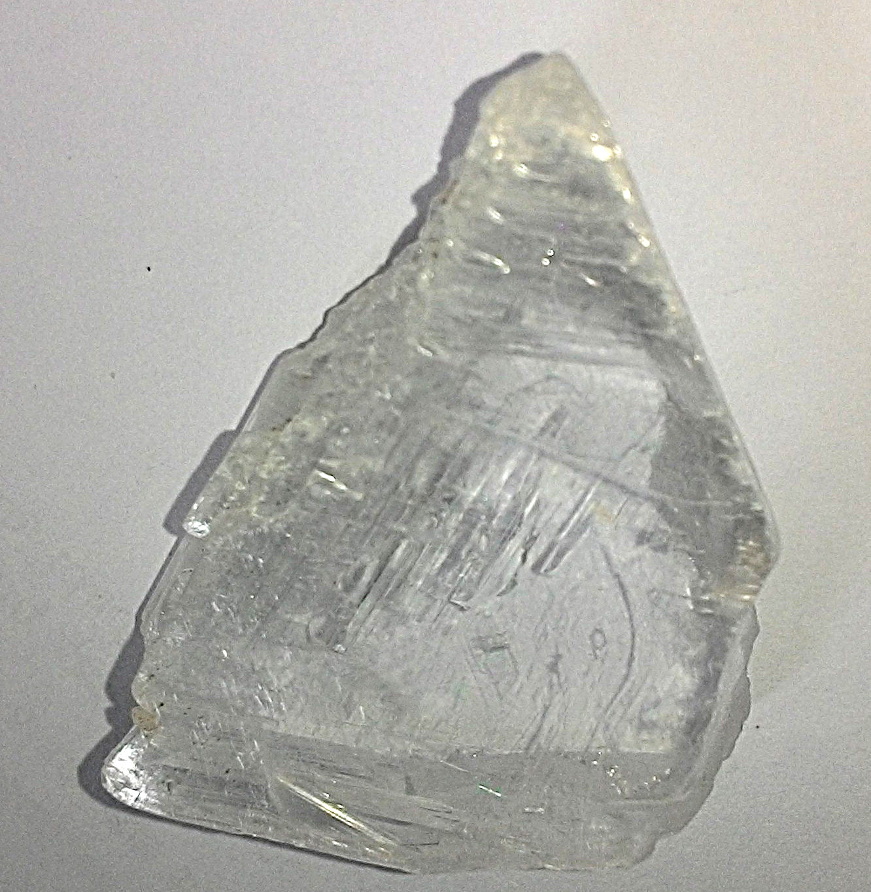
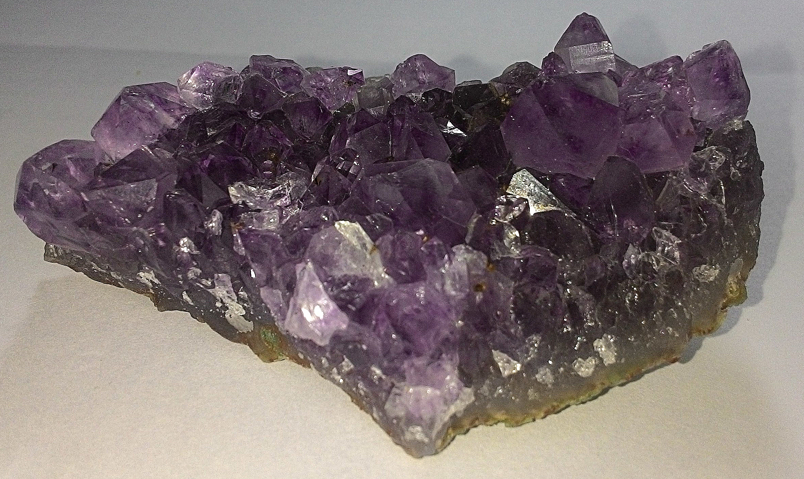
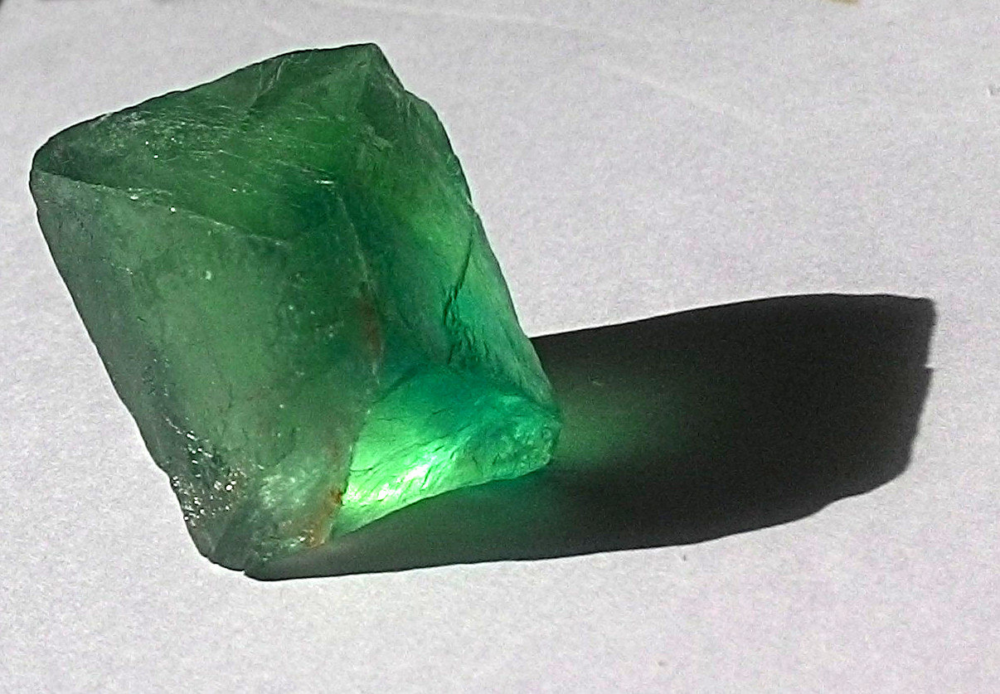
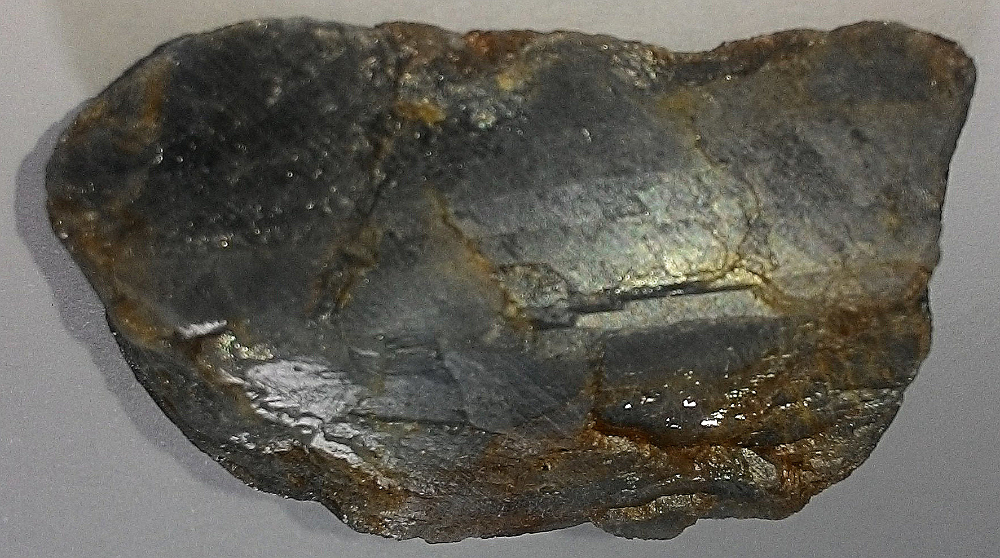
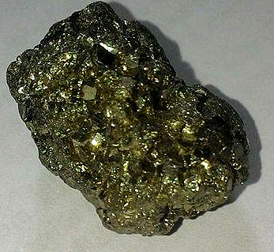
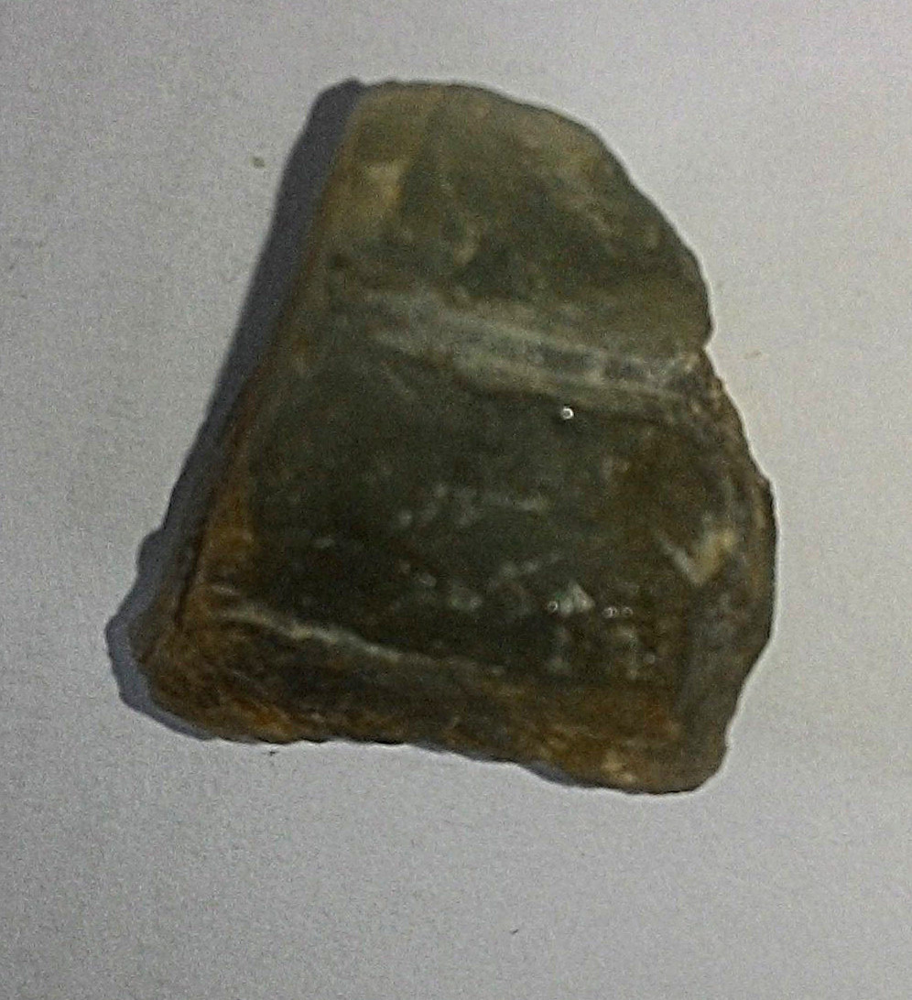

## Classificação dos minerais
###1. Gipsita (selenita)

{#id .class width=400}

- Brilho: O brilho é não metálico, especificamente na amostra em questão (selenita) é vítreo

- Cor: Transparente ao branco

- Traço: Branco

- Dureza: 2

- Clivagem: 3 planos de clivagem a aproximadamente 90º

- Peso Específico: 2,3 $g/cm^3$

- Hábito: Tabular

- Composição Química: $CaSO_4\cdot2 H_2 O$

- Classificação Química: Sulfato

- Outros: Uma característica marcante da gipsita é a dureza baixa. É bastante usado na indústria para a produção de gesso, que por sua vez tem aplicação em diversos setores, como em cerâmicas, moldes, na engenharia civil, entre outros.

###2. Quartzo (Ametista)

{#id .class width=400}

- Brilho: Não metálico, vítreo

- Cor: Na amostra em questão é roxo, mas pode variar entre várias cores como o branco, rosa, vermelho, preto, amarelo, marrom, laranja, etc.

- Traço: Branco

- Dureza: 7

- Clivagem: Clivagem ausente, mas possui fratura conchoidal

- Peso Específico: 2,66 $g/cm^3$

- Hábito: Hábito cristalino prismático, na amostra em questão é uma drusa

- Composição Química: $SiO_2$

- Classificação Química: Tectosilicato

- Outros: Por ser uma ametista, apresenta compostos de ferro e/ou manganês, o que dá a cor característica. Bastante utilizado em jóias.

$\\$
$\\$
$\\$

###3. Fluorita

{#id .class width=400}

- Brilho: Vítreo

- Cor: Verde

- Traço: Branco

- Dureza: 4

- Clivagem: Octaédrica perfeita

- Peso Específico: 3,01 $g/cm^3$ até 3,25 $g/cm^3$

- Hábito: Maciço

- Composição Química: $CaF_2$

- Classificação Química: A fluorita é um haleto

- Outros: Fluorita é bastante utilizado como fundente para metais, tratamento de minérios como prata e ouro, e também utilizado em jóias como gema.

$\\$
$\\$
$\\$
$\\$
$\\$
$\\$
$\\$

###4. Coríndon

{#id .class width=400 position=absolute left=100px}

- Brilho: Não metálico, vítreo

- Cor: Na amostra em questão é azul, mas pode ser vermelho, rosa, amarelo, etc.

- Traço: Branco

- Dureza: 9

- Clivagem: Clivagem ausente

- Peso Específico: 4 $g/cm^3$

- Hábito: granular

- Composição Química: $Al_2O_3$

- Classificação Química: Óxido

- Outros: Devido a alta dureza, o coríndon é bastante utilizado na indústria como parte de materiais abrasivos. Como gema, as mais conhecidas são o rubi e a safira.

###5. Pirita

{#id .class width=400}

- Brilho: Metálico

- Cor: Amarelo latão

- Traço: Verde escuro

- Dureza: 6 até 6,5

- Clivagem: Clivagem ausente

- Peso Específico: 5 $g/cm^3$

- Hábito: Dodecaédrico pentagonal na amostra, mas pode ser cúbico ou octaédrico

- Composição Química: $FeS_2$

- Classificação Química: Sulfeto

- Outros: É um dos principais minerais utilizados para extrair ferro. Também é utilizado para produção de ácido sulfúrico.

###6. Euclásio

{#id .class width=400}

- Brilho: Não metálico, vítreo

- Cor: Verde pálido

- Traço: Branco

- Dureza: 7,5

- Clivagem: 1 direção de clivagem perfeita

- Peso Específico: 3,1 $g/cm^3$

- Hábito: Prismático

- Composição Química: $BeAlSiO_4(OH)$

- Classificação Química: Hidróxido

- Outros: Utilizado como gema.

### Bibliografia
